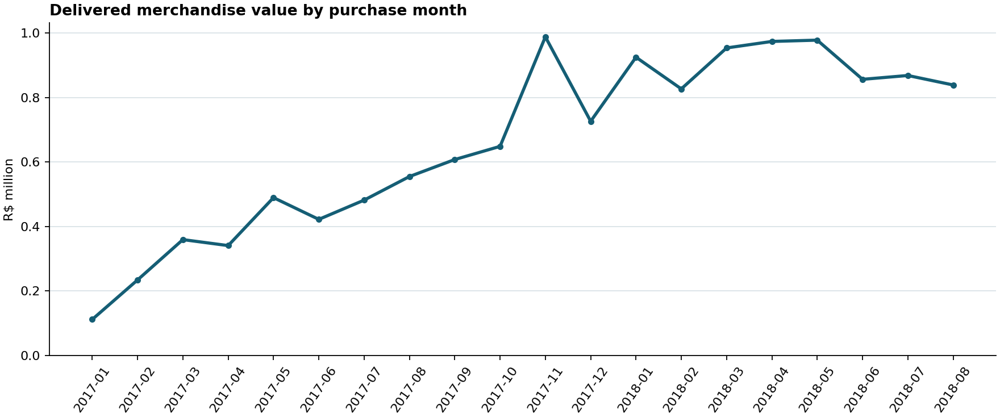
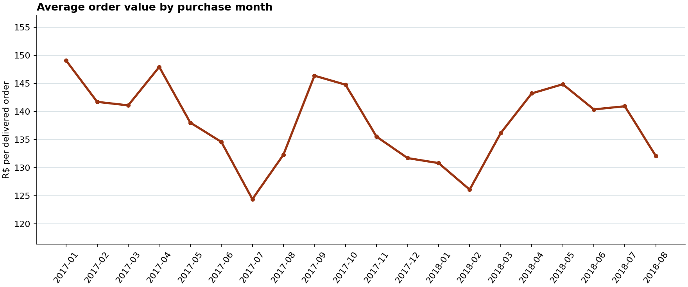
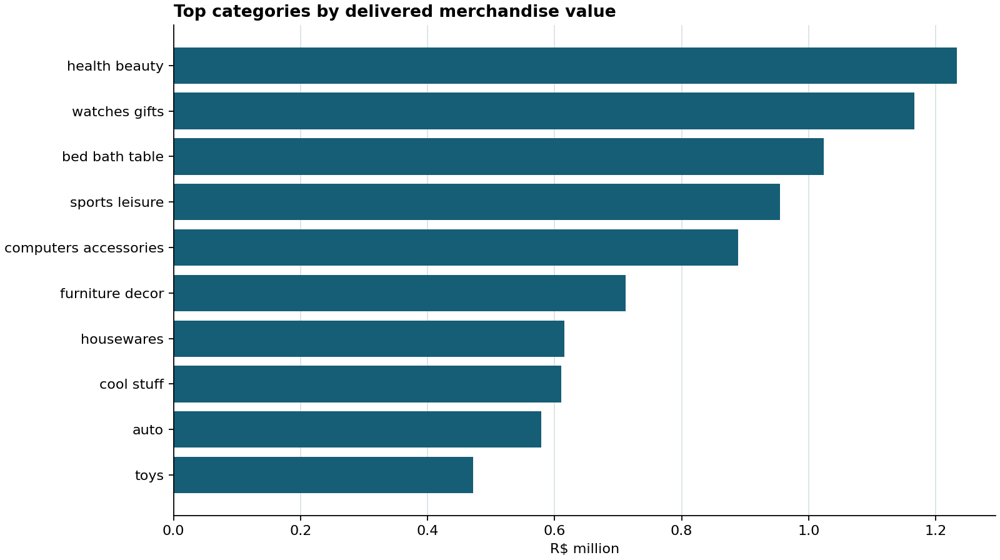

# Olist analytics findings

Source: [Olist Brazilian E-Commerce, version 2](https://www.kaggle.com/datasets/olistbr/brazilian-ecommerce).
The data is historical (2016–2018), so these are dataset findings rather than current business results.

## Metric definitions

- **Delivered merchandise value (revenue proxy):** sum of item `price` for orders with status `delivered`; excludes freight, tax and unobserved refunds. Currency: BRL.
- **Average order value (AOV):** delivered merchandise value / delivered orders, assigned to purchase month.
- **Lifetime repeat-purchase rate:** customers (`customer_unique_id`) with at least two delivered orders / customers with at least one delivered order.
- **Monthly repeat-buyer rate:** buyers active that month who have a previous delivered order / all buyers active that month. Prior orders can precede the displayed window.
- **Late-delivery rate:** delivered orders whose actual delivery calendar date is after the estimated calendar date / delivered orders with both dates.

## Results

- Delivered merchandise value across all source dates: **R$ 13,221,498.11** from **96,478** delivered orders; overall AOV **R$ 137.04**.
- In the displayed months, delivered merchandise value peaked in **November 2017 (R$ 987,765.37)**.
- Monthly AOV varied from **R$ 124.38 (July 2017)** to **R$ 149.06 (January 2017)**; it was R$ 149.06 in the first displayed month and R$ 132.04 in the last.
- Lifetime repeat-purchase rate: **2,801 / 93,358 = 3.00%**.
- Late-delivery rate: **6,534 / 96,470 = 6.77%**.
- Top category by delivered merchandise value: **health_beauty (R$ 1,233,131.72)**.
- **610** products lack an original category and are retained as `uncategorized`.

| Top category | Delivered merchandise value |
|---|---:|
| health_beauty | R$ 1,233,131.72 |
| watches_gifts | R$ 1,166,176.98 |
| bed_bath_table | R$ 1,023,434.76 |
| sports_leisure | R$ 954,852.55 |
| computers_accessories | R$ 888,724.61 |

## Trends and scope

The monthly charts cover January 2017 through August 2018. The sparse boundary months remain in the raw, modeled and monthly mart tables; `monthly_metrics.csv` includes them with `in_trend_window = false`.

See `monthly_metrics.csv` and `category_metrics.csv` for the underlying values.
